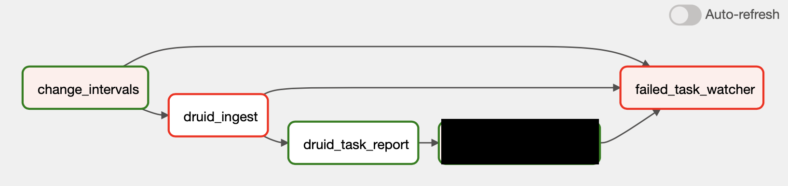

# airflow-operators

#### : druid operator, hook 커스터마이징

## 1. 배경
- airflow에서는 DruidOperator로 spec을 제출 후, 드루이드에서 내보내는 처리된 데이터의 정보나 에러 메시지를 확인할 수 없다.
  
  

  #### [ DruidOperator ]
  - airflow connection에 등록 되어 있는 druid host 정보를 이용하여 druid spec json을 제출하는 operator이다.
  - 내부 코드에서 DruidHook을 사용하는데 DruidHook에서 ingestion task id를 받아오는 코드가 있다.

## 2. 목적
  1. ingestion task id를 커스터마이징 한 DruidHook에서 사용할 수 있도록 한다.
  2. ingestion task id 를 이용해 druid task reports API를 사용할 수 있도록 한다.

## 3. 구현
  - DruidOperator, DruidHook 모두 커스터마이징해서 ingestion task id를 airflow의 XCom으로 푸쉬하도록 변경한다.
  - CustomDruidOperator와 CustomDruidHook은 기존 airflow DruidOperator, DruidHook를 상속 받아 변경 해야 하는 메소드만 오버라이딩하거나 필요한 메소드를 추가한다.
    - CustomDruidHook에 druid ingestion task 리포트를 반환하는 메소드인 get_task_report를 추가한다.
  - CustomTaskReportOperator는 execute 메소드에서 CustomDruidHook의 get_task_report 메소드를 호출한다.

## 4. 테스트
- XCom으로 druid task id, status 추가

  

#### 4.1 ingestion 성공한 dag
- druid에서 처리된 데이터 정보 반환

  
  

#### 4.2 ingestion 실패한 dag
- druid ingestion 에러 메시지 반환

  
  
